# Bộ Ảnh Chụp Màn Hình Rails Chinook Ransack

> 🌐 Language / Ngôn ngữ: [English](SCREENSHOTS.md) | **Tiếng Việt**

File này tổng hợp các ảnh chụp giao diện hiện tại để minh họa cho tài liệu dự án.

## Dashboard và xác thực

### Dashboard quản trị sau khi đăng nhập
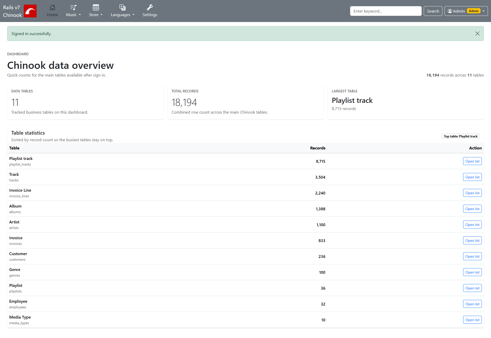

### Trang đăng nhập
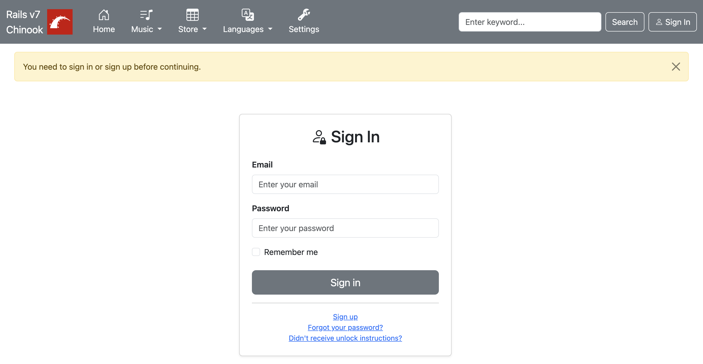

### Trang đăng ký tài khoản
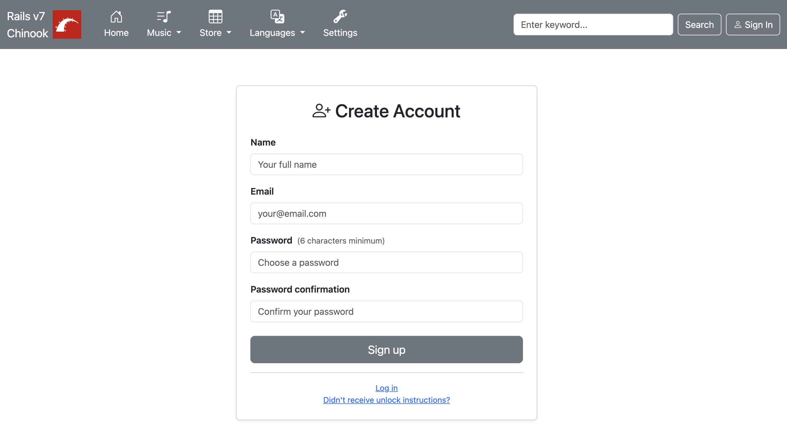

### Trang chỉnh sửa hồ sơ
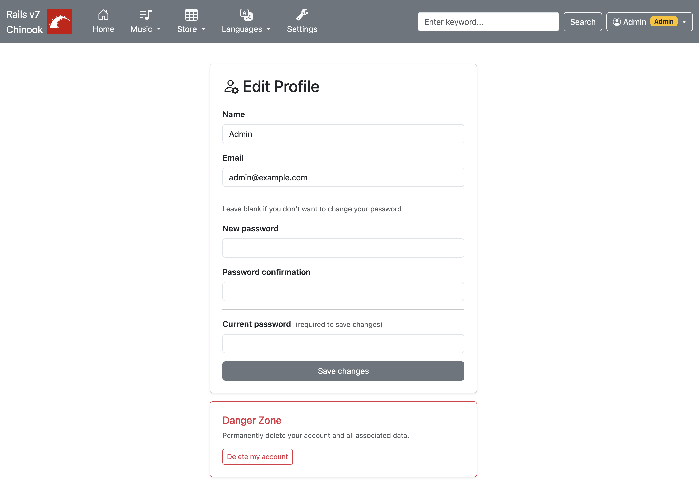

## Các trang danh sách dữ liệu

### Danh sách nghệ sĩ ở chế độ card
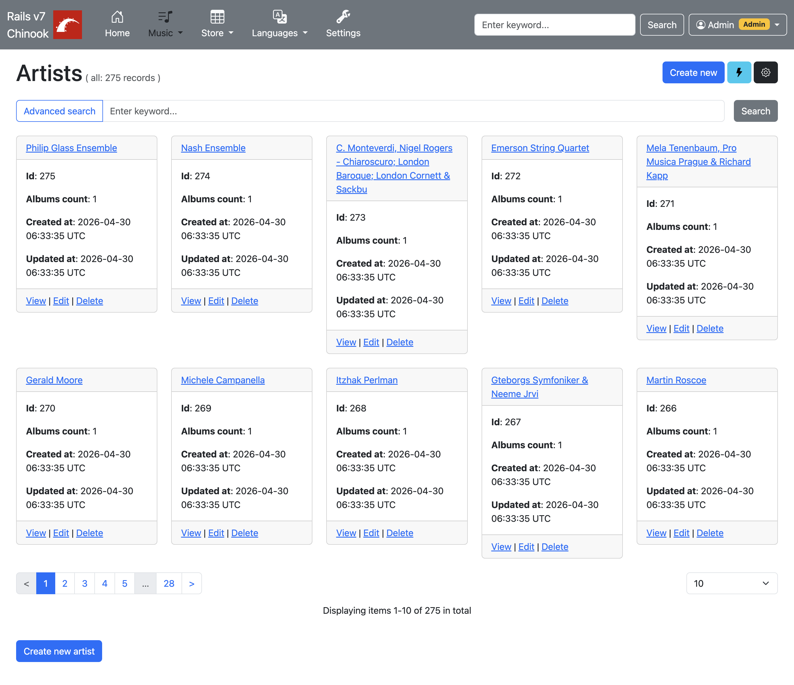

### Danh sách album ở chế độ card
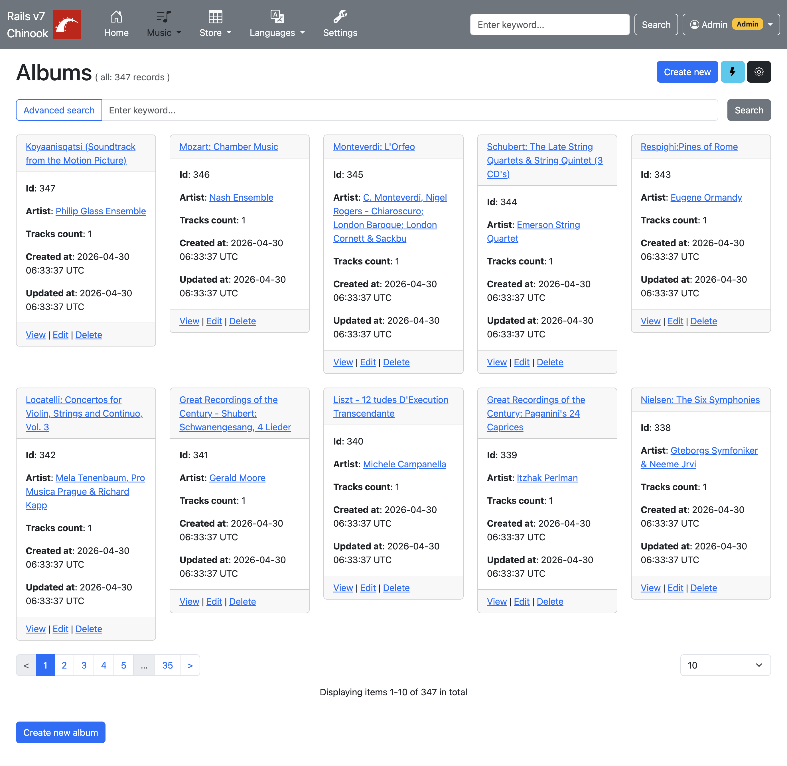

### Danh sách bài hát ở chế độ card
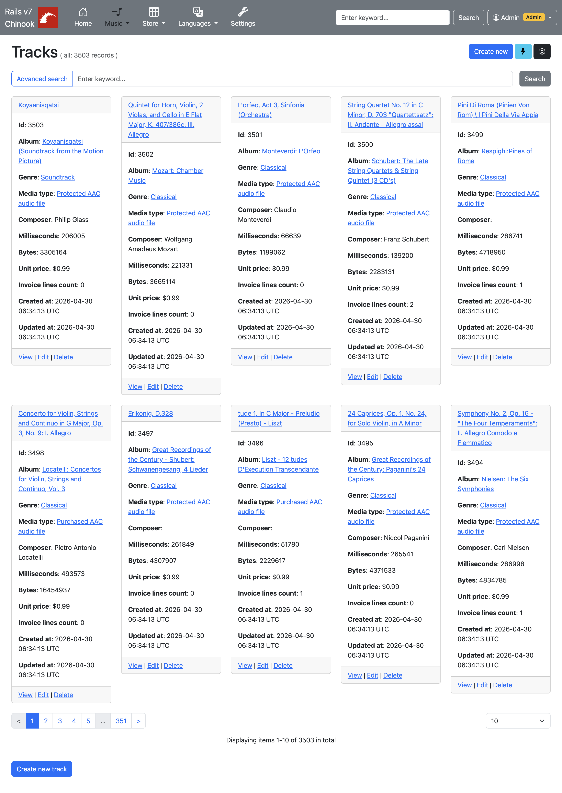

### Danh sách playlist ở chế độ card
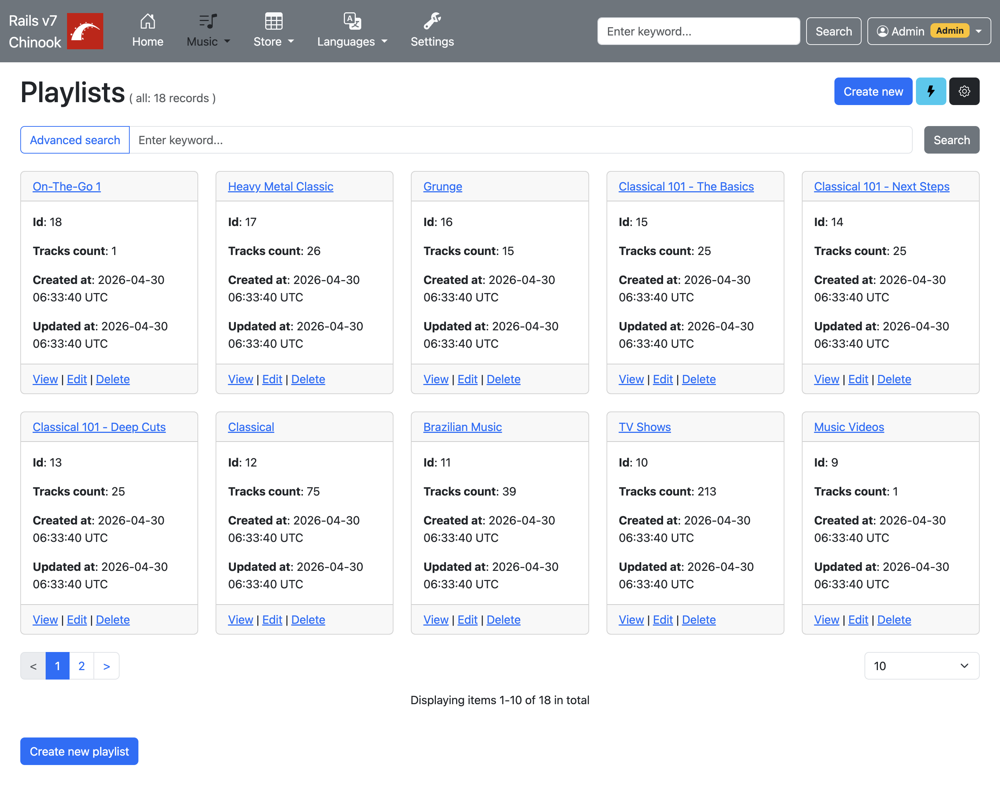

### Danh sách khách hàng ở chế độ bảng
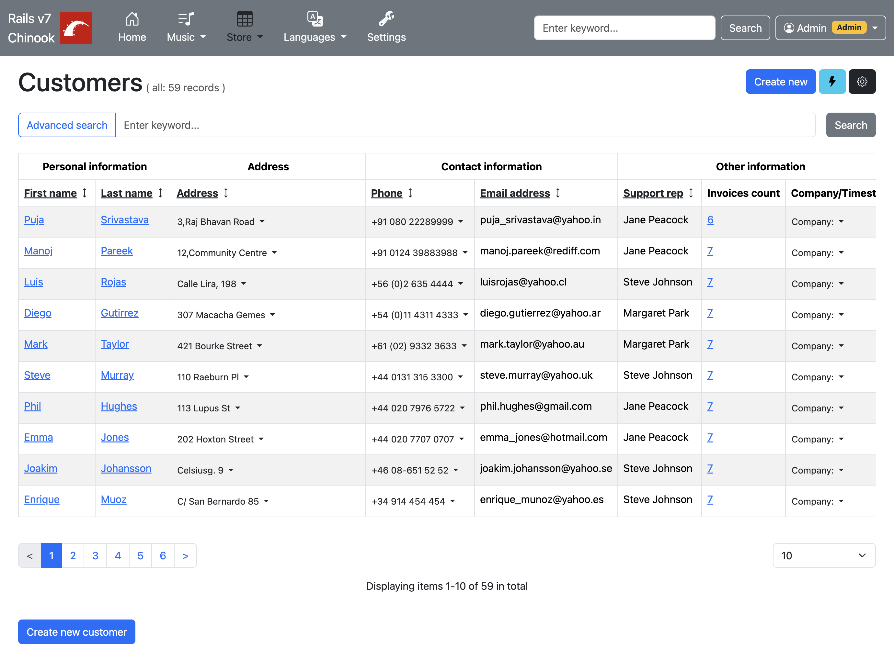

### Danh sách nhân viên ở chế độ bảng
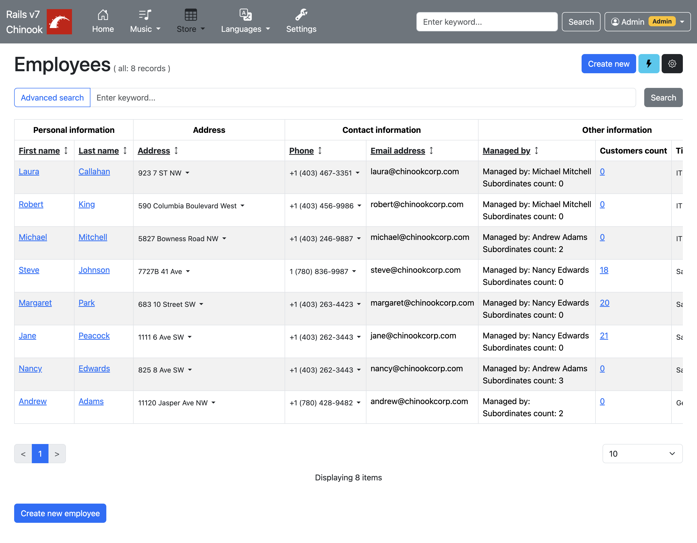

### Danh sách hóa đơn ở chế độ bảng
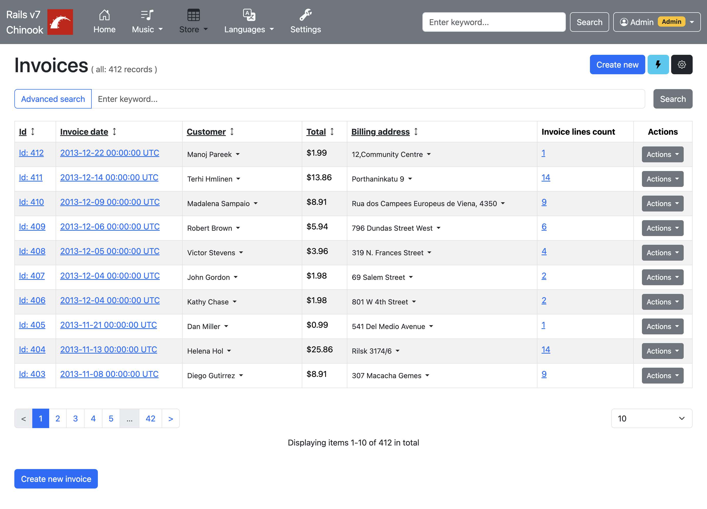

### Danh sách dòng hóa đơn ở chế độ bảng
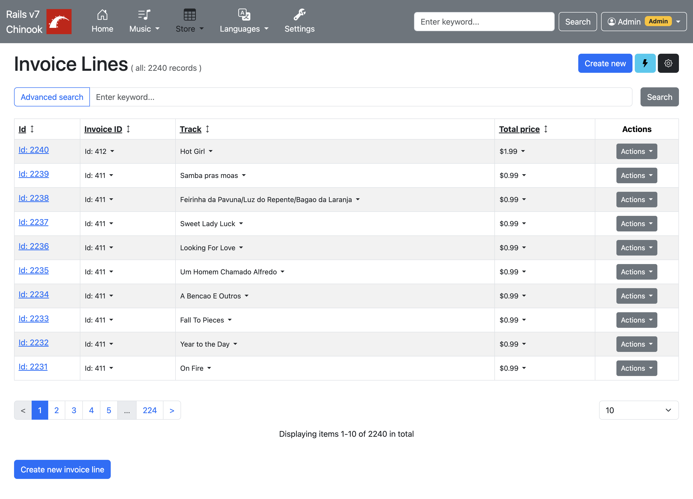

## Sidebar bộ lọc

### Bộ lọc khả dụng thay đổi theo từng model
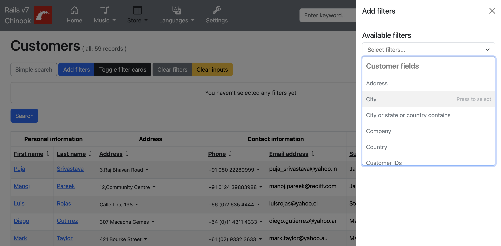

### Các mẫu bộ lọc định nghĩa sẵn
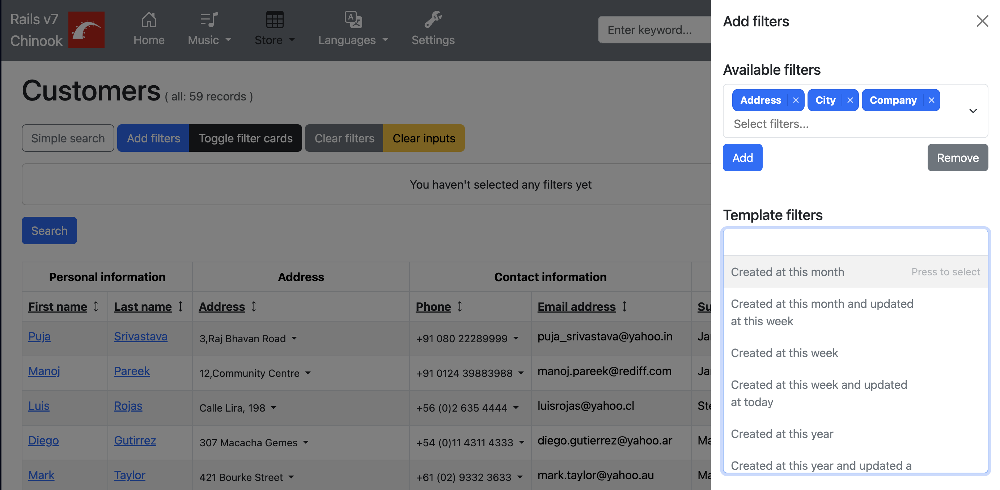
